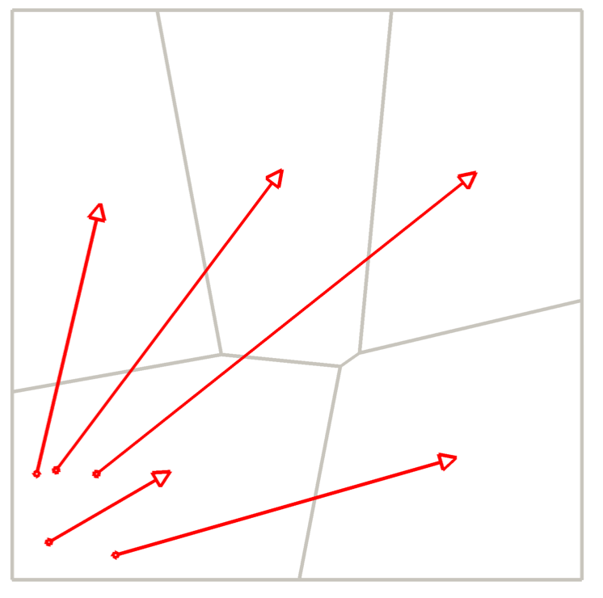
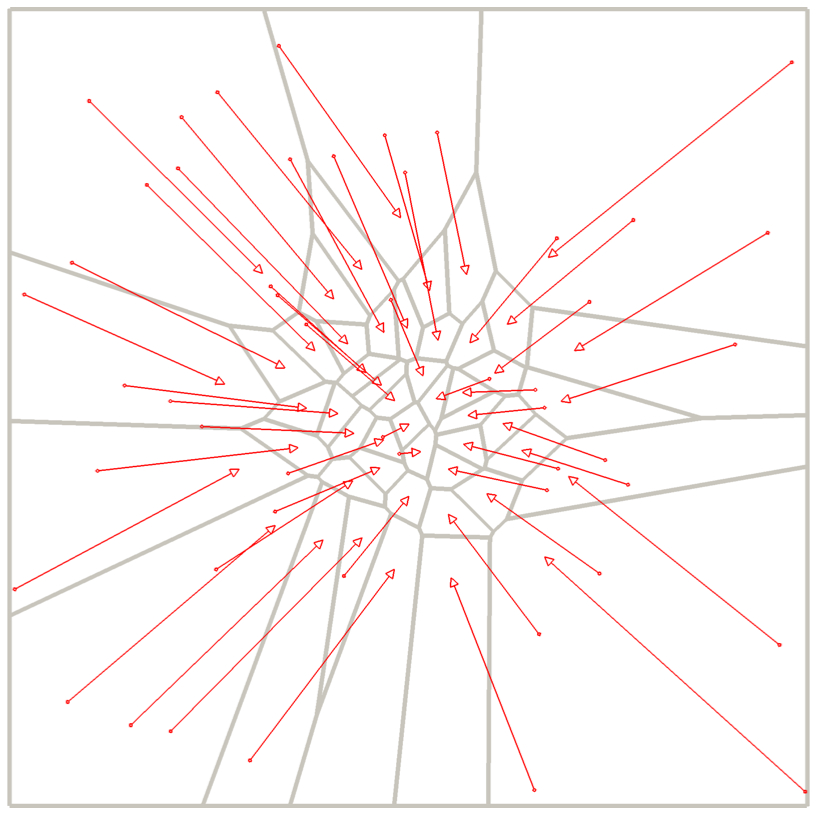
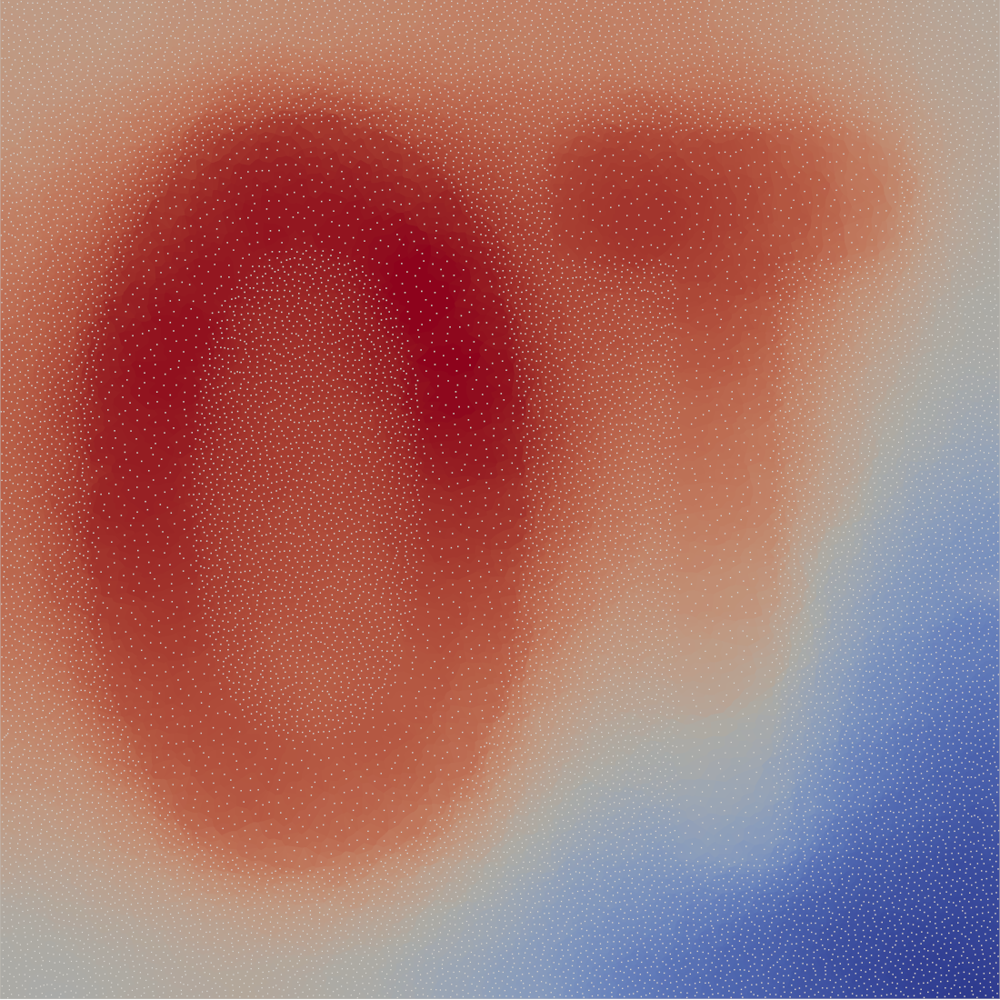
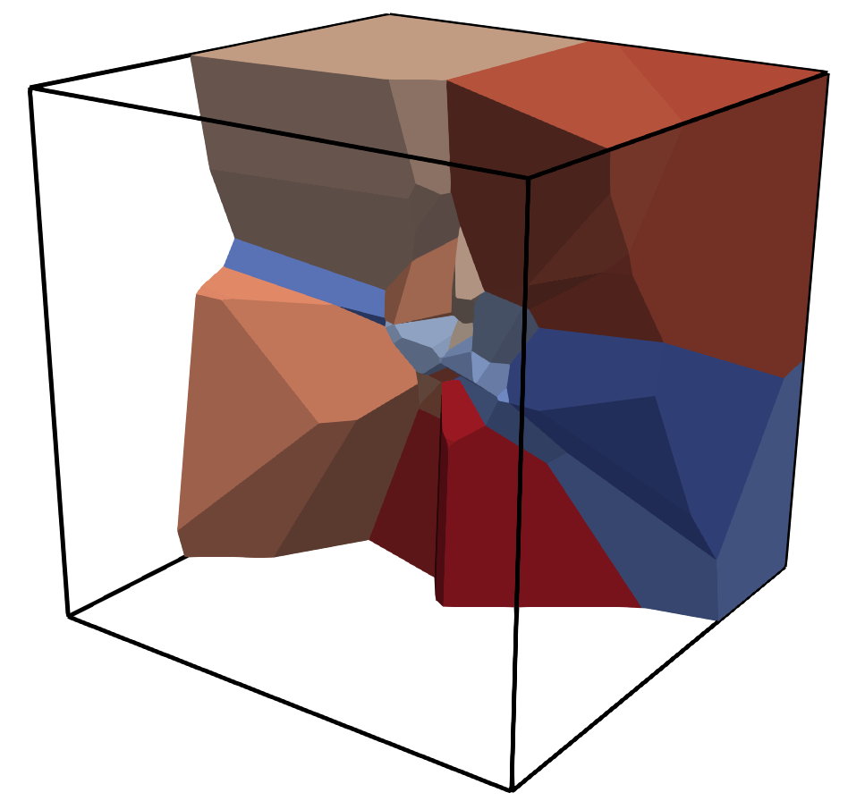
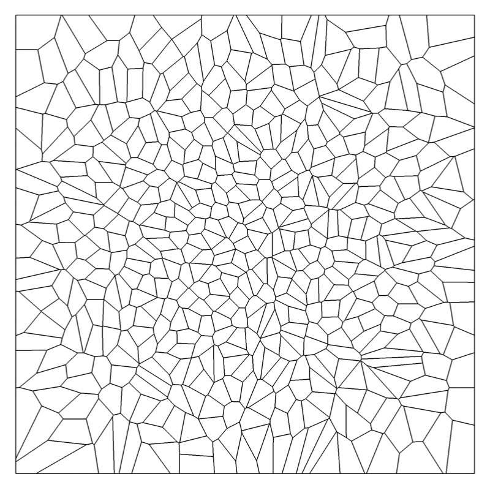
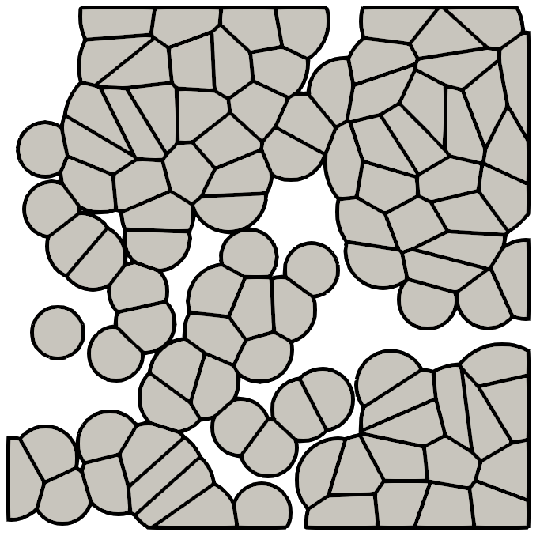

Python tutorial
===============

.. _installation:

Installation
------------

To use Sdot, you can install it using pip:

.. code-block:: console

   $ pip install sdot

Optionally, if you want to work directly with the sources or with the latest version, you can install it manually

.. code-block:: console

   $ git clone https://github.com/sd-ot/sd-ot.git
   $ cd sd-ot
   $ make install # or `make link` to use symbolic links pointing to the source

A first transport map
---------------------

In this first example, we look for a 2D transport map from the characteristic function of the 1x1 square in 2D to a sum of weighted diracs in a 0.2x0.2 square, with the L2 norm for the transport cost.

.. code-block:: python

   import numpy, sdot

   # some constants
   nb_diracs = 5
   nb_dims = 2

   # optimize the kantorovitch potential
   tm = sdot.compute_optimal_transport_map(
      # source density
      #   Question pour Quentin: on pourrait peut être utiliser `characteristic_function`
      #   pour rester dans l'ambiance mais ça serait peut être pompeux...
      sdot.is_inside(
         # sdot contains some basic geometry tools
         sdot.parallelogram(
            # first corner
            [0, 0],
            # axes
            [[1, 0], [0, 1]]
         )
      ),
      # target density
      sdot.weighted_point_cloud(
         # positions
         numpy.random.rand(nb_diracs, nb_dims) * 0.2,
         # weights (so that masses of the source and target dentities are the same)
         numpy.ones(nb_diracs) / nb_diracs
      )
      # if not specified, sdot creates a target based on the 1^dim cube,
      # with the same mass than the source
   )

   # visualization (arrows are possible because at least one density is a sum of diracs)
   tm.show(arrows=True)

This gives a representation like:

where the arrows go from the centroids of the cells (subspace assigned to a given dirac) the dirac positions.

`sdot.compute_optimal_transport_map` returns a `TransportMap` object which contains methods for the most common computations (e.g. `tm.transport_cost()` to get the overall transport cost). Depending on the input data, `sdot.compute_optimal_transport_map` may return more specialized instances.

In the example above, `tm` is actually an instance of `SemiDiscreteTransportMap` which contains methods like `tm.transport_cost_for_each_dirac()` or `tm.diagram()` which gives a `PowerDiagram` (because or the L2 norm) which contains a bunch of geometrical computation methods.

More complex densities
----------------------

In general, densities are handled in sdot as symbolic formula.

It is possible to construct them using helper functions as seen before (`sdot.characteristic_function`, `sdot.weighted_point_cloud`) or starting with coordinate symbols (`sdot.coords`) with generic construction operators (`+`, `sdot.sum`, ...).

In the following example, one will use a bounded gaussian function:

.. code-block:: python

   import numpy, sdot

   # symbolic formula for the source density.
   source = sdot.exp(- 10 * sdot.sum(- sdot.coords ** 2)) * \
            # Rq/question pour Quentin: j'imagine qu'on pourrait traiter des domaines non bornés,
            # ce qui simplifierait l'exemple, mais nous emmèrait peut-être sur des développements
            # conséquents et peut-être inutiles (je suis pas certain de pouvoir estimer ça rapidement)
            sdot.is_inside(sdot.parallelogram([-1, -1], [[2, 0], [0, 2]]))

   # mass of the source to get the correct mass for the target density
   target = sdot.weighted_point_cloud(
      # positions
      numpy.random.rand(nb_diracs, nb_dims) * 2 - 1,
      # weights (so that masses of the source and target dentities are the same)
      numpy.ones(nb_diracs) / nb_diracs * sdot.mass(source)
   )

   # compute and display
   tm = sdot.compute_optimal_transport_map(source, target)
   tm.show(arrows=True, line_width_arrows=2)

This gives a representation like:

Here is another example where the source density is defined piecewise on an uniform grid:

.. code-block:: python

   import numpy, sdot, PIL.Image

   # one loads an image and makes sure that the mass is equal to 1
   img = np.asarray(PIL.Image.open("ot.png"))
   img = np.sum(img * 1.0 + 25, axis=2)
   img = img / np.mean(img)

   # find how to move mass to the corresponding target density
   tm = sdot.compute_optimal_transport_map(
      sdot.piecewise_constant_on_an_uniform_grid(
         img, # values
         [0, 0], # first corner
         [[1, 0], [0, 1]] # axes
      ),
      sdot.weighted_point_cloud(
         numpy.random.rand(50, 2)
      )
   )

   tm.show(arrows=True, line_width_arrows=2)

An example in 3D
----------------

Sdot tries to find the dimension according to the input data. This is an example of a semi-discrete 3D computation:

.. code-block:: python

   import numpy, sdot

   t = numpy.linspace(-1,1,20)
   g = numpy.meshgrid(t,t,t)
   img = numpy.exp(-10 * sum(v**2 for v in g))

   tm = sdot.compute_optimal_transport_map(
      sdot.make_weighted_diracs(
         numpy.random.rand(50,3)
      ),
      sdot.uniform_grid_piecewise_polynomial_distribution(
         img,
         [0,0,0],
         [1,1,1]
      )
      # dim = ... to force the space dimension
   )

   # we write a vtk file to open it later in tools like paraview
   tm.write_vtk("ex.vtk")

Using sdot objects
------------------

Most of the functions use instances of Sdot objects to do the actual work. Using them directly may give access to some optimizations, both in term of computation time and code size.

In the following example, we compute several transport map that use the same source density. Using instances that are kept between iterations allows Sdot to cache the unmodified computations and use previous ones as starting points.

.. code-block:: python

   import numpy, sdot

   # same input args than sdot.find_optimal_transport_map
   fo = sdot.OptimalTransportMapFinder(
      sdot.dirac_distribution(
         numpy.random.rand(50,2)
      )
   )

   for num_iter in range(4):
      # set or modify the target density
      fo.set_target_density(
         # here we use a symbolic expression
         sdot.bounded(- 10 ** num_iter * sdot.exp(sdot.sum(sdot.coords ** 2)))
      )

      # Computations that are specific to the source density are kept from each iteration to the next.
      # By default, the new Kantorovitch potentials are computed from those of the previous iteration.
      fo.run()

      # animation
      tm.write_vtk(f"ex_{ num_iter }.vtk")

Transport cost
--------------

By default, sdot uses the L2 norm for the transport cost (:math:`\int ||x - y||^2_2 d\rho`). Of course, it is possible to define another transport costs. It can be done using names for the most common ones (e.g. "L2", ...) or symbolic expression to get more flexibility.

Expressions may use the following symbol: `sdot.source_pos` is the position of a source item, `sdot.target_pos` is the position of a target item, `sdot.kantorovitch_potential` is the kantorovitch potential and `sdot.created_mass` is the created mass (which is enforce to be 0 if not used in the cost expression). Additionally, there are shortcuts, like for instance `sdot.distance_2` which is the norm 2 of the distance between `sdot.source_pos` and `sdot.target_pos`.

.. warning::
   Pour Quentin: "item" n'est peut-être pas le meilleur terme mais je n'ai pas su quoi mettre...

Here is an example where the cost becomes infinite if the square of the distance is greater than the Kantorovitch potential.

.. warning::
   Pour Quentin: l'exemple me paraît un peu pourri en fait dans la mesure où c'est le fait que la masse de la source est plus petite que la masse de la cible qui fait apparaître les cercles, même en gardant le coût précédant.

.. code-block:: python

   import numpy, sdot

   target_radius = 0.05
   nb_diracs = 100

   tm = sdot.find_optimal_transport_map(
      sdot.dirac_distribution( 
         numpy.random.rand(nb_diracs, 2),
         # for this example we specify the mass of each dirac, individually
         numpy.ones(nb_diracs) * numpy.pi * target_radius ** 2
      ),
      # we specify the target distribution in order to prescribe the target mass
      sdot.bounded(1)
      # and here is the transport cost expression
      transport_cost = sdot.distance_2 ** 2 + sdot.inf * (sdot.distance_2 ** 2 > sdot.kantorovitch_potential),
   )

   tm.show()

It produces something like:

Here is an example with unbalanced mass tranport to illustrate the use of the `sdot.created_mass` symbol:

.. code-block:: python

   import numpy, sdot

   nb_diracs = 100

   tm = sdot.find_optimal_transport_map(
      sdot.dirac_distribution( 
         numpy.random.rand(nb_diracs,2),
         # the mass of the source distribution is not equal to the mass of the target distribution
         numpy.ones(nb_diracs) / nb_diracs
      ),
      # target distribution
      sdot.exp(- sdot.norm_2(sdot.coords) ** 2)
      # creation or destruction of the mass is allowed in this example
      transport_cost = p.distance_2 ** 2 + 10 * p.created_mass,
   )

   tm.show()

.. warning::
   Pour Quentin: cette exemple ne fonctionne pas encore et je ne suis même pas certain qu'on soit sur le bon genre de formule pour le coût. À discuter.

Large number of unknowns
------------------------

To handle things like MPI calls, out-of-core data, GPUs, ... sdot tries to be as flexible as possible, notably in terms of framework choice.

Currently, for python, we support Dask and CuPy but if one needs to use sdot with another libraries we will be happy to develop the interfaces.

Here is an example with data specified with Dask:

.. code-block:: python

   from dask.distributed import Client
   import dask.array as da
   import numpy, sdot

   client = Client(n_workers=4)

   # here we take a dask array as input
   tm = sdot.find_optimal_transport_map(
      sdot.dirac_distribution( 
         da.random.rand((1000000,2), chunks=4)
      ),
   )

   # in this case, transport_cost_for_each_dirac will return a Dask array
   print(da.sum(tm.transport_cost_for_each_dirac()))

